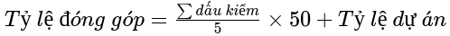

# Network Programming

Network Programming (Workspace)

## NetworkTeam4

1. Huỳnh Tấn Lực - 16CNTT1: huynhtanluc.auto@gmail.com
2. Trần Văn Khải - 19CNTT1: vankhaihpb@gmail.com

## I. Cài đặt GitHub Desktop

### 1. macOS và Windows

Download tại: [https://desktop.github.com/](https://desktop.github.com/)

### 2. Linux

Download tại: [https://github.com/shiftkey/desktop/releases/](https://github.com/shiftkey/desktop/releases/)

## II. Cài đặt IDE/Code Editor

Cài cả hai:

### 1. Visual Studio Code (Code Editor)

Download tại: [https://code.visualstudio.com/](https://code.visualstudio.com/)

#### a) Cài đặt tiện tích cho Java

Download tại: [https://marketplace.visualstudio.com/items?itemName=vscjava.vscode-java-pack](https://marketplace.visualstudio.com/items?itemName=vscjava.vscode-java-pack)

#### b) Cài đặt tiện tích cho PDF

Download tại: [https://marketplace.visualstudio.com/items?itemName=tomoki1207.pdf](https://marketplace.visualstudio.com/items?itemName=tomoki1207.pdf)

#### c) Cài đặt tiện tích cho Office

Download tại: [https://marketplace.visualstudio.com/items?itemName=cweijan.vscode-office](https://marketplace.visualstudio.com/items?itemName=cweijan.vscode-office)

#### d) Cài đặt tiện tích cho Git

Download tại: [https://marketplace.visualstudio.com/items?itemName=donjayamanne.githistory](https://marketplace.visualstudio.com/items?itemName=donjayamanne.githistory)

### 2. Apache NetBeans LTS (IDE)

Download tại: [https://netbeans.apache.org/download/](https://netbeans.apache.org/download/)

## III. Cài đặt và thiết lập Git

Download tại: [https://git-scm.com/](https://git-scm.com/)

#### Bước 1: Mở Git bash hoặc Terminal để thiết lập git bằng cách sao chép rồi dán vào VSCode và điền thông tin vào đoạn lệnh sau:

```shell
git config --global user.name "Ho Va Ten"
git config --global user.email "username@email.com"

ssh-keygen -t ed25519 -C "username@email.com"

eval "$(ssh-agent -s)"
ssh-add ~/.ssh/id_ed25519
cat ~/.ssh/id_ed25519.pub
```

#### Bước 2: Copy dòng tương tự như vầy:

`ssh-ed25519 ... username@email.com`

#### Bước 3: Thêm SSH keys vào tài khoản của bạn:

Vào trang: [https://github.com/settings/keys](https://github.com/settings/keys) . Sau đó nhấn vào nút `New SSH key` rồi dán vào `Key` rồi đặt tiêu đề. Cuối cùng nhấn vào `Add SSH key`.

## IV. Cài đặt Java

### 1. macOS và Windows

**Bước 1:** Mở VSCode lên vào nhấn `Ctrl + Shift + P` rồi gõ: `"Java: Conf"` và chọn `Java: Configure Java Runtime`.

**Bước 2:** Chọn `OpenJDK 11 (LTS)` và `Hotspot (Recommended)` và nhấn `Download`.

### 2. Ubuntu

`Lưu ý: Kiểm tra giờ và ngày trước khi cài đặt.`

Mở Terminal và copy những dòng lệnh sau:

```shell
sudo apt -y update
sudo apt install -y default-jdk default-jre
```

## IV. Sử dụng Git

#### 1. Các dòng commit (cam kết) cơ bản

* Create: Tạo mới một thứ gì đó chưa có.
* Add: Thêm một thứ đã có sẵn.
* Update: Cập nhật một/hàng loạt thứ gì đó.
* Modify: Cập nhật một thay đổi nhỏ.
* Move: Di chuyển từ cái này sang cái kia.
* Remove: Loại bỏ một thứ gì đó thứ đó có thể thêm trở lại.
* Delete: Xóa bỏ một thứ gì đó mà mình không đề cập tới nó nữa.

#### 2. Phương thức giao tiếp

1. Pull (Download): Kéo các commit về máy tính.
2. Push (Upload): Đẩy các commit lên đám mây.

## V. Các thư mục

* `docs`: Tài liệu.
* `src`: Chứa mã nguồn.
* `clis`: Các thành phần của giao diện dòng lệnh.
* `examples`: Các ví dụ.
* `helpers`: Các thành phần hỗ trợ.
* `models`: Các lớp của các đối tượng.

## VI. Đánh giá

### 1. Bảng kiểm
| STT | Họ và tên                 | 1    | 2    | 3 | 4 | 5 | dự án |
| :-: | ---------------------------- | ---- | ---- | - | - | - | ------- |
|  1  | Huỳnh Tấn Lực – 16CNTT1  | :heavy_check_mark: | :heavy_check_mark: |   |   |   |         |
|  2  | Ngô Hoàng Thiện - 17CNTT2 | :heavy_check_mark: | :heavy_check_mark: |   |   |   |         |
|  3  | Nguyễn Đắc Minh - 19CNTT1 | :x: | :x: |   |   |   |         |
|  4  | Tăng Tấn Doan - 19CTUD     | :heavy_check_mark: | :x: |   |   |   |         |
|  5  | Trần Văn Khải - 19CNTT1   | :x: | :x: |   |   |   |         |
|  6  | Sivilay Phimmasan - 19CNTT1  | :heavy_check_mark: | :heavy_check_mark: |   |   |   |         |

### 2. Công thức tính tỷ lệ đóng góp


